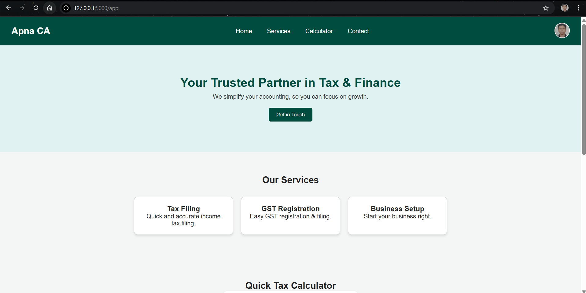

# 🧾 Apna CA

Author - HARSH BAJPAI  
Collaborator - Hani Dwivedi  
Created on 11-10-2025  
**Apna Chartered Accountant** is a simple **frontend-only web project** built using **HTML, CSS, and JavaScript**.  
It showcases a professional online CA service website with sections for services, a tax calculator, and a contact form.  
Perfect for beginners who want to practice basic web development concepts.

---

## 🌐 Live Preview

You can host this on **GitHub Pages**, **Vercel**, or **Netlify** for free.  
Example URL after deployment:
```
https://yourusername.github.io/apna-CA/
```

---

## 📁 Project Structure
```
apna-chartered-accountant/
│
├── index.html      # Main webpage
├── style.css       # Styling and layout
├── script.js       # Interactive logic (tax calc, form)
└── README.md       # Project documentation
```

---

## 🧩 Features
✅ Responsive landing page  
✅ Professional CA services section  
✅ Income Tax Calculator (for Indian slabs)  
✅ Contact form with JS validation  
✅ Smooth scroll and clean UI design  

---

## 🚀 Getting Started

### 1️⃣ Clone the repository
```bash
git clone https://github.com/yourusername/apna-ca.git
```

### 2️⃣ Open the project
```bash
cd apna-chartered-accountant
```

### 3️⃣ Run locally
Open the `index.html` file directly in your browser  
or use a simple live server:
```bash
npx serve
```

Then open 👉 [http://localhost:5000](http://localhost:5000)

---

## 🧮 Tax Calculator Logic
Tax slabs used (simplified for FY 2024-25):

|   Income Range (₹)    |  Tax Rate  |
|-----------------------|------------|
| Up to ₹2,50,000       |    0%      |
| ₹2,50,001 – ₹5,00,000 |    5%      |
| ₹5,00,001 – ₹10,00,000|    20%     |
| Above ₹10,00,000      |    30%     |

The logic is implemented in `script.js`.

---

## 🖌️ UI Design
- **Primary Color:** Dark Green `#004d40`  
- **Accent:** Teal `#00796b`  
- **Font:** Poppins (Google Fonts)  
- **Style:** Clean, modern, responsive  

---

## 📬 Contact Form
The contact form currently shows an alert message on submit.  
You can connect it to **EmailJS** or **Google Sheets API** to store or send real responses.

---

## 🧠 Future Enhancements
- GST Calculator  
- Chart.js income visualization  
- Login/Register (frontend mock)  
- Dark mode toggle  
- Hosting with real domain  

---

## 💻 Technologies Used
- **HTML5** – Structure  
- **CSS3** – Layout & Styling  
- **JavaScript (Vanilla)** – Interactivity  

---

## 👨‍💼 About
Created by **Harsh Bajpai**  
For demo, practice, and portfolio purposes.

If you like this project, give it a ⭐ on GitHub!

---

### 📸 Preview

---
